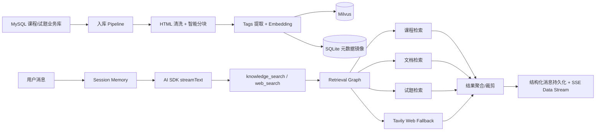

# 📚 RAG-Agent：企业级数字教材知识库对话系统

> 一个从企业内部项目抽离的 RAG AI Agent 服务端实现，支持数字教材内容入库、分层检索、多轮会话记忆与流式对话输出。

[](LICENSE)
[](https://nodejs.org)
[](https://milvus.io)

---

## 🎯 项目简介

本项目是企业内部「数字教材智能问答」系统的服务端抽离版本，当前仓库聚焦以下主链路：

```text
课程/章节数据 → HTML 清洗 → 智能分块 → Tags 提取 → Embedding 向量化
→ Milvus + SQLite 双写 → 会话记忆加载 → AI SDK Tool Calling → Retrieval Graph 检索编排 → SSE 流式回复
```

除了基础的 RAG 入库与问答，本项目还补齐了：

- 会话列表、历史消息、标题维护
- 会话记忆压缩与 token 使用监控
- chunk 元数据查询、修订与删除
- 检索过程状态回传、媒体引用与来源信息透传

> ⚠️ 前端因涉及版权内容未抽离，本项目依然聚焦 **RAG 服务端核心链路** 的实现与工程化实践。

---

## 🏗️ 系统架构



### 为什么需要三种数据库？

| 数据库     | 角色                     | 设计原因                                                                           |
| ---------- | ------------------------ | ---------------------------------------------------------------------------------- |
| **MySQL**  | 业务数据源（只读）       | 原有数字教材业务库，不侵入、不修改，仅读取课程、章节、试题等结构化数据             |
| **Milvus** | 向量检索引擎             | 存储课程 chunk / 文档 chunk 的 Embedding，承担语义检索与过滤                        |
| **SQLite** | 元数据镜像 + 会话存储层  | 存储 chunk 镜像、会话消息、会话摘要，支撑双写补偿、会话管理和轻量后台运维           |

---

## 🧩 后端核心模块

| 模块               | 核心职责                                            | 关键能力                                                                |
| ------------------ | --------------------------------------------------- | ----------------------------------------------------------------------- |
| **RAG 知识入库**   | 课程 / 章节内容清洗、分块、打标、向量化、落库       | HTML 清洗、语义分块、批量写入、SSE 进度推送、Milvus + SQLite 双写       |
| **Chat 流式对话**  | 负责聊天入口、活跃运行控制、SSE 输出与终态快照      | AI SDK `streamText`、Tool Calling、主动中止、结构化 parts 持久化        |
| **Retrieval Graph**| 按图编排课程/文档/试题/联网检索并组装上下文         | 意图分析、Graph 条件分支、结果聚合、充分性评估、联网兜底                |
| **Memory 模块**    | 维护 session memory、摘要压缩、token usage 与互斥锁 | Session 级互斥锁、摘要压缩、最近轮次窗口、历史消息分页                  |
| **运维接口**       | 管理 chunk、会话、记忆状态                           | chunk 查询/修改/删除、会话 CRUD、手动压缩、token usage 查询、健康检查   |

---

## ⚙️ 技术选型

| 组件                   | 选型                                 | 备注                                                               |
| ---------------------- | ------------------------------------ | ------------------------------------------------------------------ |
| **Embedding 模型**     | 阿里 `text-embedding-v4`             | 默认 1024 维，可通过环境变量调整                                   |
| **LLM（对话+意图）**   | OpenAI 兼容接口模型                  | 通过 `OPENAI_BASE_URL` + `CHAT_MODEL_NAME` 适配百炼 / OpenAI 兼容网关 |
| **对话执行框架**       | AI SDK + 自建 streaming 基础设施     | `streamText` + tool calling + shared stream 管道                   |
| **检索编排**           | LangGraph                            | Retrieval Graph 条件路由                                           |
| **流式输出协议**       | Vercel AI SDK Data Stream            | 聊天主接口返回 SSE，附带 sources / mediaRefs / exercisePreview     |
| **向量库**             | Milvus 2.6.13                        | 启动时自动 ensure collection，支持课程 / 文档两个 collection        |
| **业务库**             | MySQL（只读）                        | 查询课程元数据、章节内容、试题资源                                 |
| **本地存储**           | SQLite (`better-sqlite3`)            | chunk 镜像、chat_sessions、chat_messages、结构化 assistant parts   |
| **HTML 解析**          | `cheerio`                            | 清洗教材富文本，提取结构化正文                                     |
| **参数校验/配置兜底**  | `zod` + 自定义 env 工具              | 集中式配置读取，环境变量非法值直接 fail fast                       |
| **并发控制与限流**     | `p-limit` + 自定义 rate limiter      | 控制入库并发、模型 RPM/TPM、Embedding RPM/TPM                      |
| **SSE 断连感知**       | `AbortSignal + Express 中间件`       | 客户端断连时自动终止下游 LLM / Embedding / 检索调用                |

---

## 🚀 快速开始

### 1️⃣ 环境准备

```bash
# Node.js >= 18
# pnpm >= 9
# MySQL 5.7+（已有业务数据）
# Milvus 2.6.13
```

### 2️⃣ 启动依赖服务

```bash
# 启动 Milvus（推荐 Docker）
# 可参考 Milvus 官方 docker compose 方案

# MySQL 请自行准备业务数据
# 课程/试题查询逻辑可参考：
# - server/src/modules/course/course.service.ts
# - server/src/modules/retrieval/services/exercise-retrieval.service.ts
```

### 3️⃣ 安装与运行

```bash
# 克隆项目
git clone <your-repo>
cd rag-agent

# 安装依赖（workspace 根目录执行）
pnpm install

# 配置环境变量
cp server/.env.example server/.env
# 编辑 server/.env：配置 MySQL / Milvus / LLM / Tavily 等

# 开发模式
pnpm dev

# 类型检查 / lint
pnpm type-check
pnpm lint

# 构建
pnpm build

# 生产启动
node server/dist/main.js
```

### 4️⃣ 关键环境变量

```bash
# LLM / Embedding
OPENAI_API_KEY=
OPENAI_BASE_URL=
CHAT_MODEL_NAME=
EMBEDDINGS_MODEL_NAME=

# Milvus
MILVUS_ADDRESS=
MILVUS_COLLECTION_NAME=
MILVUS_DOCUMENTS_COLLECTION_NAME=
EMBEDDING_DIMENSION=

# SQLite
SQLITE_PATH=

# MySQL
DB_HOST=
DB_PORT=
DB_USER=
DB_PASSWORD=
DB_NAME=

# Retrieval / Memory
KNOWLEDGE_SEARCH_TOP_K=
DOCUMENT_SEARCH_TOP_K=
RETRIEVAL_MAX_SNIPPETS=
MEMORY_RECENT_ROUNDS=
AGENT_RECURSION_LIMIT=
```

> 服务启动时会自动执行 `ensureCollection()` 和 SQLite schema 初始化，因此首次启动前请确保 Milvus 与数据库连接配置正确。

### 5️⃣ 核心接口示例

```http
# 健康检查
GET /health

# 课程全量入库（支持 ?stream 开启 SSE）
POST /api/ingest/course/101?stream

# 单章节入库（支持 ?stream 开启 SSE）
POST /api/ingest/course/101/chapter/2001?stream

# 主聊天接口（SSE / data stream）
POST /api/chat
Content-Type: application/json

{
  "sessionId": "demo-session",
  "message": "帮我总结这章里关于闭包的核心知识点",
  "showReasoning": false
}

# 主动中止当前会话生成
POST /api/chat/abort
Content-Type: application/json

{
  "sessionId": "demo-session"
}

# 会话列表
GET /api/sessions?page=1&pageSize=20

# 会话消息分页
GET /api/sessions/demo-session/messages?page=1&pageSize=40

# 手动压缩会话记忆
POST /api/memory/compact
{
  "sessionId": "demo-session"
}

# 查询会话 token 使用情况
GET /api/memory/token-usage?sessionId=demo-session

# 查询 chunk 列表
GET /api/chunks?page=1&pageSize=20&courseId=101
```

---

## 📦 核心特性 & 可学习点

### 🔹 智能分块策略

- ✅ 结合标题层级、正文内容和块大小做语义分块，尽量避免知识点被硬切断
- ✅ 入库前统一做 HTML 清洗，减少教材富文本噪音对 Embedding 的干扰
- ✅ 支持课程级、章节级重入库，便于局部更新

### 🔹 Retrieval Graph 检索编排

```text
analyze_intent
→ retrieve_courses
→ retrieve_documents
→ retrieve_exercises
→ merge_filter_rank
→ assess_sufficiency
→ maybe_web_fallback
→ synthesize_context
```

- ✅ 按意图动态走课程、文档、试题、联网兜底等分支
- ✅ 检索图以节点方式拆分，便于逐段调试与扩展
- ✅ 每个节点完成后可回传前端进度事件，用于展示检索状态

### 🔹 Chat + SSE 流式输出

- ✅ 聊天主流程拆分到 `modules/chat`，按 router / service / stream-chat / utils 分层组织
- ✅ 使用 AI SDK `streamText` 承担工具调用与回复生成，配合共享 streaming 基础设施输出 SSE
- ✅ 除文本回复外，还会透传 `sources`、`mediaRefs`、`exercisePreview` 等结构化数据
- ✅ 支持 `/api/chat/abort` 主动中止当前会话的活跃生成任务

### 🔹 会话记忆与压缩机制

- ✅ SQLite 持久化保存会话、消息和摘要，不依赖外部缓存
- ✅ assistant 终态按结构化 `parts + metadata` 持久化，便于历史回放和异常轮次标记
- ✅ 基于最近轮次窗口 + 历史摘要，控制长对话上下文体积
- ✅ 按 session 维度加互斥锁，避免并发写入导致消息顺序错乱
- ✅ 基于 `prompt_tokens` 水位和消息数量双条件触发压缩

### 🔹 Milvus + SQLite 双写补偿

- ✅ 课程 chunk 写入 Milvus 的同时写入 SQLite 镜像
- ✅ chunk 管理接口支持查询、修订 tags / mediaRefs、按 ID 删除
- ✅ 启动后 SQLite 自动建表，适合单服务部署和轻量运维

### 🔹 调试与工程化细节

- ✅ 请求级 `AbortSignal`，客户端断连后自动中止长任务
- ✅ Agent 日志与 SSE 调试写入器，便于排查 Tool/流式输出问题
- ✅ provider / repository / sql / service 分层拆分，降低单文件复杂度
- ✅ 配置集中管理，非法环境变量在启动期尽早暴露
- ✅ 文档 collection 尚未就绪时安全降级，不阻塞主聊天流程

---

## 📁 项目结构

```text
├── package.json                     # workspace 根脚本
├── pnpm-workspace.yaml
├── README.md
└── server/
    ├── package.json
    ├── .env.example
    ├── src/
    │   ├── main.ts                  # 入口：启动服务、初始化 Milvus / SQLite
    │   ├── app.ts                   # Express 实例、中间件注册、路由挂载
    │   ├── config/                  # 配置集中管理
    │   ├── middleware/              # 请求日志、断连中止、统一错误处理
    │   ├── providers/               # MySQL / Milvus / SQLite / LLM / Embedding / Tavily 封装
    │   ├── modules/
    │   │   ├── chat/                # 聊天入口、stream-chat、聊天工具与运行态管理
    │   │   ├── memory/              # 记忆服务、压缩 prompt、repository 与 session mutex
    │   │   ├── retrieval/           # Retrieval Graph、检索服务、检索 SQL
    │   │   ├── ingest/              # 入库 Pipeline 与 utils
    │   │   ├── session/             # 会话管理接口 + service
    │   │   ├── chunk/               # chunk 管理接口 + service
    │   │   └── course/              # 课程业务查询 + SQL
    │   └── shared/
    │       ├── errors/
    │       ├── streaming/
    │       ├── types/
    │       └── utils/
    └── tsconfig.json
```

---

## 📝 开发规范

- ✅ 所有核心逻辑尽量保留 **中文注释**，重点解释「为什么这样设计」
- ✅ 使用 `pnpm workspace` 统一管理脚本，根目录命令默认透传到 `server`
- ✅ 环境变量通过 `dotenv-flow` + 配置模块集中读取，避免散落读取
- ✅ 错误处理统一收敛到中间件，普通 JSON 接口返回统一结构，聊天接口保留原生 SSE data stream

---

## 📄 License

[MIT License](LICENSE) © 2026

---

> ✨ **如果这个项目对你有启发，欢迎 ⭐ Star 支持！**  
> 有任何 RAG 工程化问题，也欢迎提 Issue 交流～
