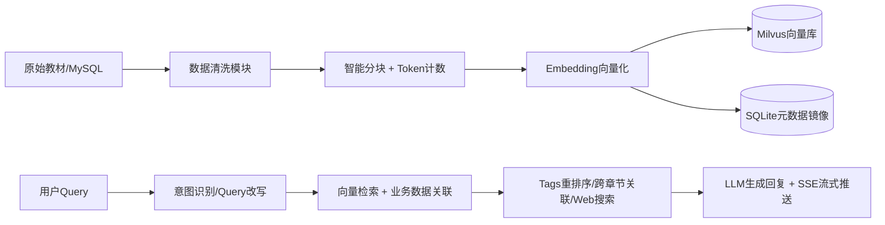

# 📚 RAG-Agent：企业级数字教材知识库对话系统

> 一个从企业内部项目抽离的 RAG AI Agent 服务端实现，支持原始数字教材文档清洗入库、智能检索与多轮对话。

[](LICENSE)
[](https://nodejs.org)
[](https://milvus.io)

---

## 🎯 项目简介

本项目是企业内部「数字教材智能问答」系统的服务端抽离版本，核心实现：

```
原始教材文档 → 清洗分块 → 向量化存储 → 意图识别 → 混合检索 → 对话回复
```

> ⚠️ 前端因涉及版权内容未抽离，本项目聚焦 **RAG 服务端核心链路** 的实现与工程化实践。

---

## 🏗️ 系统架构



### 为什么需要三种数据库？

| 数据库     | 角色                  | 设计原因                                                                           |
| ---------- | --------------------- | ---------------------------------------------------------------------------------- |
| **MySQL**  | 业务数据源（只读）    | 原有数字教材业务库，不侵入、不修改，仅读取课程/章节/内容元数据                     |
| **Milvus** | 向量检索引擎          | 存储文本 Embedding，支持高维向量相似度检索、动态 Schema、JSON 字段扩展             |
| **SQLite** | 元数据镜像 + 补偿存储 | 避免直接操作 MySQL；存储 Milvus 全量元数据镜像，支持双写补偿、WAL 模式、细粒度回滚 |

---

## 🧩 后端核心模块

| 模块             | 核心职责                                    | 关键能力                                                |
| ---------------- | ------------------------------------------- | ------------------------------------------------------- |
| **RAG 知识入库** | 课程数据清洗 → 分块 → 向量化 → 写入存储     | 富文本解析、语义分块、Token 精准计数、双写补偿          |
| **AI 检索召回**  | 用户意图识别 → 向量+业务混合检索 → 结果组装 | 意图分类、Query 改写、Tags 重排序、跨章节关联、记忆管理 |

---

## ⚙️ 技术选型

| 组件                 | 选型                           | 备注                                             |
| -------------------- | ------------------------------ | ------------------------------------------------ |
| **Embedding 模型**   | 阿里 `text-embedding-v4`       | 默认 1024 维，支持 64~2048 多维度可配置          |
| **LLM（对话+意图）** | Qwen 3.6 Plus                  | 支持工具调用、多轮记忆、长上下文                 |
| **LLM（Tags 提取）** | Qwen 3.6 Plus                  | 入库时自动抽取知识点标签                         |
| **编排框架**         | LangChain + 手写 Pipeline      | LangChain 管理 Prompt/LLM 调用，手写控制复杂流程 |
| **向量库**           | Milvus 2.6.13                  | 支持动态 Schema、JSON 字段、标量+向量混合过滤    |
| **业务库**           | MySQL（只读）                  | 不新增表/字段，仅 SELECT 读取业务数据            |
| **本地存储**         | SQLite (`better-sqlite3`)      | Milvus 元数据镜像，双写 + 补偿机制，WAL 模式     |
| **HTML 解析**        | `cheerio`                      | 清洗富文本，提取结构化文本/标题/列表             |
| **并发控制**         | `p-limit`                      | Pipeline 中精确控制 Chunk 并行处理数             |
| **SSE 断连检测**     | `AbortSignal + Express 中间件` | 客户端断连时自动中止下游 LLM/DB 调用，节省资源   |

---

## 🚀 快速开始

### 1️⃣ 环境准备

```bash
# Node.js >= 18
# Docker & Docker Compose
# MySQL 5.7+（已有业务数据）
# Milvus 2.6.13
```

### 2️⃣ 启动依赖服务

```bash
# 启动 Milvus（推荐 Docker）
# 从 https://github.com/milvus-io/milvus/releases 下载 docker-compose.yml
docker-compose up -d

# MySQL 请自行准备业务数据
# 参考: server/src/modules/course/course.service.ts 中的 SQL 示例
```

### 3️⃣ 安装与运行

```bash
# 克隆项目
git clone <your-repo>
cd rag-agent

# 安装依赖
npm install

# 配置环境变量
cp .env.example .env
# 编辑 .env：配置 MySQL / Milvus / LLM Key 等

# 启动服务（开发模式）
npm run dev

# 或构建后启动
npm run build && npm start
```

### 4️⃣ 核心接口示例

```http
# 全量课程入库（SSE 进度推送）
POST /api/course/import/all
Content-Type: application/json
Accept: text/event-stream

# 单章节检索 + 对话
POST /api/chat
{
  "query": "函数的闭包是什么？",
  "courseId": 101,
  "sessionId": "abc-123"
}
```

---

## 📦 核心特性 & 可学习点

### 🔹 智能分块策略

- ✅ 语义边界优先 + 长度兜底，避免切断知识点
- ✅ 下限保护：最小块保留完整句子/段落
- ✅ Token 精准计数：结合 `tiktoken` + 模型实际编码规则

### 🔹 Tags 设计与跨章节关联

```ts
// Tags 多重价值：
1. 检索后重排序加分 → 提升相关性
2. 前端知识点标签展示 → 增强可解释性
3. 天然实现跨章节关联 → 同一 Tag 自动聚合
4. 基于 Tags 做相关推荐 → "学完这个，你可能还想看"
```

### 🔹 Milvus + SQLite 双写补偿机制

- ✅ 元数据双写：写入 Milvus 同时写 SQLite 镜像
- ✅ 补偿任务：定时校验不一致，自动修复
- ✅ 回滚粒度：支持按 Chapter / Block 级回滚，不影响全量

### 🔹 Pipeline 架构设计

```
全量入库：Course → Chapters → Blocks → Embedding → Batch Write
单章更新：写新版本 → 切换指针 → 异步删旧（无感更新）
检索流程：Query → 意图识别 → 向量检索 + MySQL 补充 → Tags 重排 → LLM 生成
```

### 🔹 SSE 进度推送 + 断连感知

- ✅ 中间件注入 `AbortSignal`，客户端断开自动终止下游
- ✅ Pipeline 各阶段 `progress.emit()`，实时推送处理进度
- ✅ 错误隔离：单 Chunk 失败不影响整体任务

### 🔹 检索对话与记忆管理

- ✅ LangGraph Agent + Tool-Calling 编排复杂决策流程
- ✅ 两层会话管理：`全局会话` + `课程内子会话`
- ✅ 超长对话压缩：关键信息摘要 + 滑动窗口保留

---

## 📁 项目结构

```
├── server/                          # Express 后端
│   ├── src/
│   │   ├── main.ts                  # 入口：启动 Express
│   │   ├── app.ts                   # Express 实例、中间件注册、路由挂载
│   │   ├── config/                  # 配置集中管理
│   │   ├── providers/               # 外部服务客户端封装（纯 I/O，无业务逻辑）
│   │   ├── modules/                 # 业务模块
│   │   │   ├── ingest/              # RAG 知识入库 Pipeline
│   │   │   ├── retrieval/           # AI 检索召回 Pipeline
│   │   │   └── course/              # 课程数据查询
│   │   ├── shared/                  # 跨模块共享
│   │   │   ├── types/
│   │   │   ├── errors/
│   │   │   └── utils/
│   │   │
│   │   └── middleware/              # 中间件
│   │
│   ├── package.json
└── └── tsconfig.json

```

---

## 📝 开发规范

- ✅ 所有核心逻辑均含 **中文注释**，说明「为什么这么做」
- ✅ 关键配置支持 `.env` 环境变量 + 代码默认值兜底
- ✅ 错误处理统一封装，区分「可重试」与「终止型」错误

---

## 📄 License

[MIT License](LICENSE) © 2026

---

> ✨ **如果这个项目对你有启发，欢迎 ⭐ Star 支持！**  
> 有任何 RAG 工程化问题，也欢迎提 Issue 交流～
